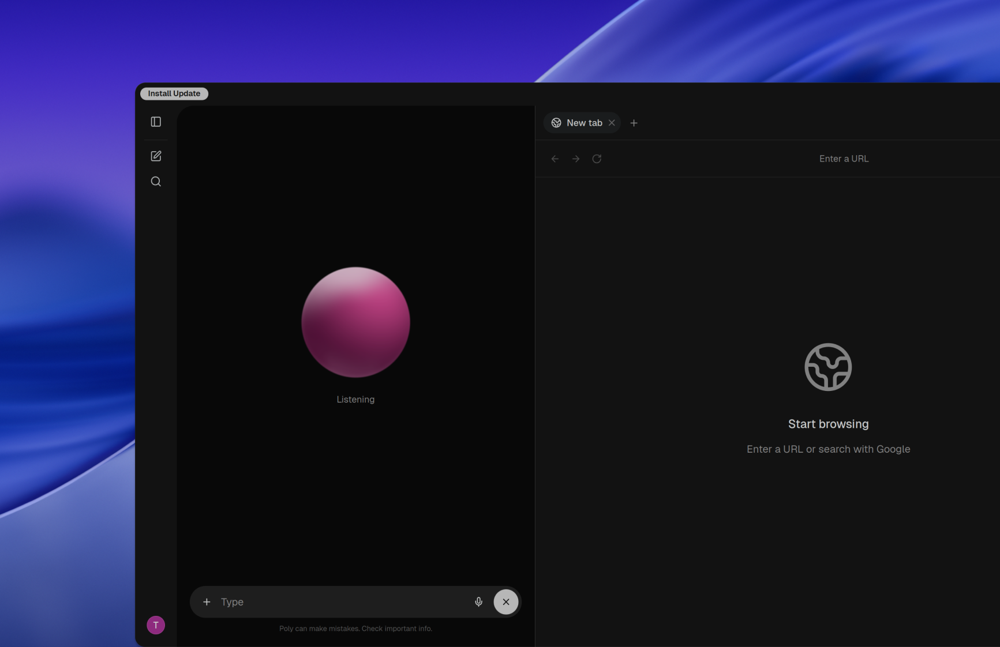

<p align="center">
  
</p>

<h1 align="center">PolyUI</h1>


PolyUI is a small, high performance and user-friendly AI desktop application designed to be able to operate entirely offline. One calm window for your models — use Ollama, OpenAI-compatible APIs, and more from a simple interface built for private, everyday conversations with local LLMs.



## Key features of PolyUI

- 🚀 **Effortless Setup**: Install seamlessly using the setup file for a hassle-free experience with support for Ollama. You **must** have ollama installed first.
- 🤝 **Ollama Integration**: Use ollama models effortlessly through this application.
- ✒️🔢 **Full Markdown and LaTeX Support**: Elevate the LLM experience with comprehensive Markdown and LaTeX capabilities. (uses LaTeX via KaTeX)
- 💭 **Multi-model conversations**: Chat with multiple local LLMs simultaneously with real-time, side-by-side streaming responses.
- 🧍**Guest mode**: Skip the login / signup process and enter guest mode for temporary chats that will not be saved to disk.
- 📚 **Archived conversations**: Keep your chat history organised by archiving old conversations.
- 🤖 **Installing models**: Install ollama models directly from the application (can't browse models)
- 📜 **System prompts**: Choose from 4 different AI personas or use a custom system prompt.
- 🔐 **Account Authentication**: Create accounts locally that you can log into.
- 🔒**Privacy first**: All conversations and models stay on your machine, nothing leaves your computer without your explicit action

## How to Install 🚀

### Installation via releases
PolyUI can be installed from the [releases](https://github.com/monolabsdev/poly-ui/releases) page. Download the file that matches your operating system and CPU:

### Command line install

Linux and macOS:
```bash
curl -fsSL https://raw.githubusercontent.com/monolabsdev/poly-ui/main/scripts/install.sh | sh
```

Windows PowerShell:
```powershell
irm https://raw.githubusercontent.com/monolabsdev/poly-ui/main/scripts/install.ps1 | iex
```

- **macOS**: download `PolyUI-*-macos-universal.dmg`.
- **Windows**: download `PolyUI-*-windows-x64-setup.exe` or `PolyUI-*-windows-x64.msi`.
- **Windows with Ollama setup**: download `PolyUI-*-windows-x64-ollama-setup.exe`.
- **Linux Debian/Ubuntu**: download `PolyUI-*-linux-x64.deb` or `PolyUI-*-linux-arm64.deb`, then install with:
  ```bash
  sudo apt install ./PolyUI-*-linux-*.deb
  ```
- **Linux Fedora/RHEL/openSUSE**: download `PolyUI-*-linux-x64.rpm` or `PolyUI-*-linux-arm64.rpm`, then install with:
  ```bash
  sudo rpm -i PolyUI-*-linux-*.rpm
  ```
- **Other Linux distributions**: download `PolyUI-*-linux-x64.AppImage` or `PolyUI-*-linux-arm64.AppImage`, then run:
  ```bash
  chmod +x PolyUI-*-linux-*.AppImage
  ./PolyUI-*-linux-*.AppImage
  ```

Use `x64` for most Intel/AMD PCs. Use `arm64` for ARM Linux devices.

### Using the Dev Branch 🌙
> [!WARNING]
> The `:dev` branch contains the latest unstable features and changes. Use it at your own risk as it may have bugs or incomplete features.

> [!NOTE]
> This repository includes AI generated code aswell as manually written code (don't be scared!!)

### Setup (dev)
Make sure you've got the essentials installed:
- Git
- Bun
- Tauri prerequisites (Rust, system deps, etc)

**Clone the repo**: `git clone https://github.com/monolabsdev/openbench-ai.git`

Then switch to the `:dev` branch or just use `:main`

```bash
git checkout dev
git pull origin dev
```

Install dependencies:
```bash
bun install
```

### 🧪 Running the dev server

```bash
bun run tauri dev
```

### 📦 Building for Production

To build the default installer:
```bash
bun run tauri build
```
To compile and build the Ollama + PolyUI installer:
```bash
bun run ollama-setup
```


## ❓ Frequently Asked Questions

###  How is PolyUI different from Open WebUI?

PolyUI focuses on simplicity and ease of setup.

Unlike platforms that commonly rely on Python, Docker, Kubernetes, or more complex deployment infrastructure, PolyUI is designed to be lightweight and straightforward to install and run locally.

## What's next? 🌟
Discover upcoming features on our [roadmap](https://sites.plane.so/issues/df577f6cf07948c492b06948e45a79c7)

## License
This project contains licenced code. Please refer to [LICENSE](LICENSE.md)

## Star History

<a href="https://www.star-history.com/?repos=monolabsdev%2Fopenbench-ai&type=date&legend=top-left">
 <picture>
   <source media="(prefers-color-scheme: dark)" srcset="https://api.star-history.com/chart?repos=monolabsdev/openbench-ai&type=date&theme=dark&legend=top-left" />
   <source media="(prefers-color-scheme: light)" srcset="https://api.star-history.com/chart?repos=monolabsdev/openbench-ai&type=date&legend=top-left" />
   
 </picture>
</a>
