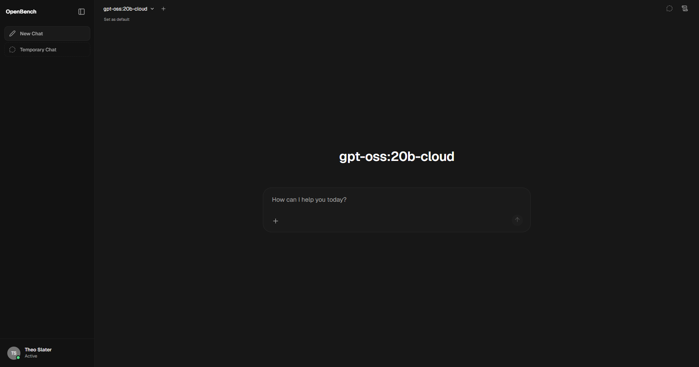

# Openbench AI

Openbench is a small, high performance and user-friendly AI desktop application designed to be able to operate entirely offline. It currently only supports **Ollama** as its primary LLM runner with hopes of providing different ones such as OpenAI-compatible APIs.

## Key features of Openbench
---

- 🚀 **Effortless Setup**: Intall seamlessly using the setup file for a hassle-free experience with support for Ollama. You **must** have ollama installed first.
- 🤝 **Ollama Integration**: Use ollama models effortlessly through this application.
- ✒️🔢 **Full Markdown and LaTeX Support**: Elevate the LLM experience with comprehensive Markdown and LaTeX capabilities. (uses LaTeX via KaTeX)
- 💭 **Multi-model conversations**: Chat with multiple local LLMs simultaneously with real-time, side-by-side streaming responses.
- 🧍**Guest mode**: Skip the login / signup process and enter guest mode for temporary chats that will not be saved to disk.
- 📚 **Archived conversations**: Keep your chat history organised by archiving old conversations.
- 🤖 **Installing models**: Install ollama models directly from the application (can't browse models)
- 📜 **System prompts**: Choose from 4 different AI personas or use a custom system prompt.
- 🔐 **Account Authentication**: Create accounts locally that you can log into.
- 🔒**Privacy first**: All conversations and models stay on your machine, nothing leaves your computer without your explicit action

## How to Install 🚀
---
### Installation via releases
Openbench can be installed through the [releases](https:github.com/theoslater/openbench/releases) page by downloading and running the installer.

### Using the Dev Branch 🌙
> [!WARNING]
> The `:dev` branch contains the latest unstable features and changes. Use it at your own risk as it may have bugs or incomplete features.

> [!INFO]
> This repository includes AI generated code aswell as manually written code (don't be scared!!)

Instructions soon!

## What's next? 🌟
Discover upcoming features on our roadmap in the [Openbench backlog](https://github.com/users/TheoSlater/projects/2)

## License
This project contains licenced code. Please refer to [LICENSE](./LICENSE.md)

## Star History

<a href="https://www.star-history.com/?repos=theoslater%2Fopenbench&type=date&legend=top-left">
 <picture>
   <source media="(prefers-color-scheme: dark)" srcset="https://api.star-history.com/chart?repos=theoslater/openbench&type=date&theme=dark&legend=top-left" />
   <source media="(prefers-color-scheme: light)" srcset="https://api.star-history.com/chart?repos=theoslater/openbench&type=date&legend=top-left" />
   
 </picture>
</a>

